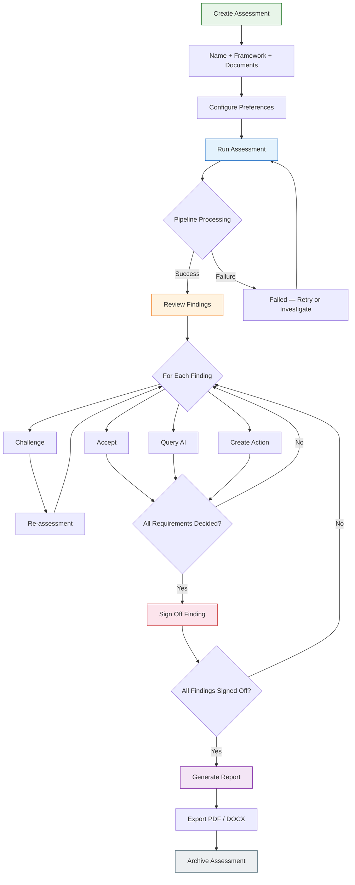

## States

| State | Description | Exit condition |
|-------|-------------|----------------|
| **Created** | Assessment named, framework selected, documents connected | User clicks "Run" |
| **Running** | Pipeline processing — ingestion, indexing, criterion matching, scoring | Pipeline completes or fails |
| **Completed** | All criteria scored, findings surfaced | — |
| **In Review** | Reviewers working through findings | All findings signed off |
| **Signed Off** | All findings have human decisions recorded | Report generated |
| **Reported** | PDF/DOCX exported with full provenance | Archived or re-run |
| **Archived** | Assessment retained for audit trail, read-only | — |

## Notes

- You can leave during pipeline processing and return later — nothing is lost
- A full assessment run takes approximately 30 minutes
- Incremental re-assessment on document changes only re-scores affected criteria
- The sign-off gate enforces that every evidence requirement has a human decision before a finding can be signed off
