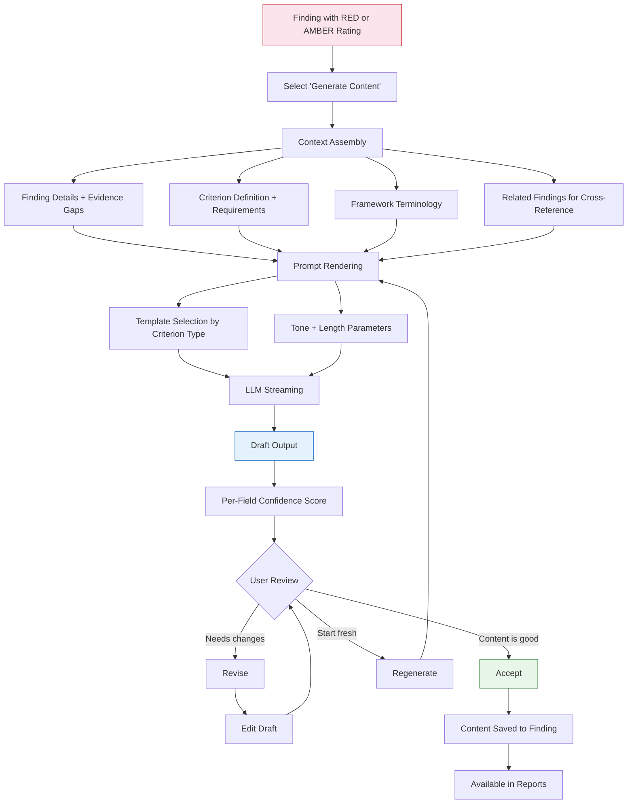

## How It Works

| Stage | What happens |
|-------|-------------|
| **Context Assembly** | The system gathers the finding's cited evidence, the criterion definition, evidence requirements, framework-specific language, and related findings to build a comprehensive prompt context. |
| **Prompt Rendering** | A template is selected based on the criterion type and rendered with the user's tone and length preferences. |
| **LLM Streaming** | Azure OpenAI GPT-4o generates the draft content with streaming output so you see it being written. |
| **Confidence Scoring** | Each field in the output gets a confidence score indicating how well-supported the draft is by the evidence. |
| **User Review** | You can accept the draft as-is, revise it manually, or regenerate with different parameters. |

## Output Types

Content generation can draft:
- Revised paragraphs addressing evidence gaps
- New risk register entries
- Gap-closing responses to criteria
- Remediation recommendations

## Provenance

Every generated piece of content tracks:
- What evidence was used as input
- Which criterion it addresses
- The confidence score at generation time
- Whether it was accepted as-is or revised
