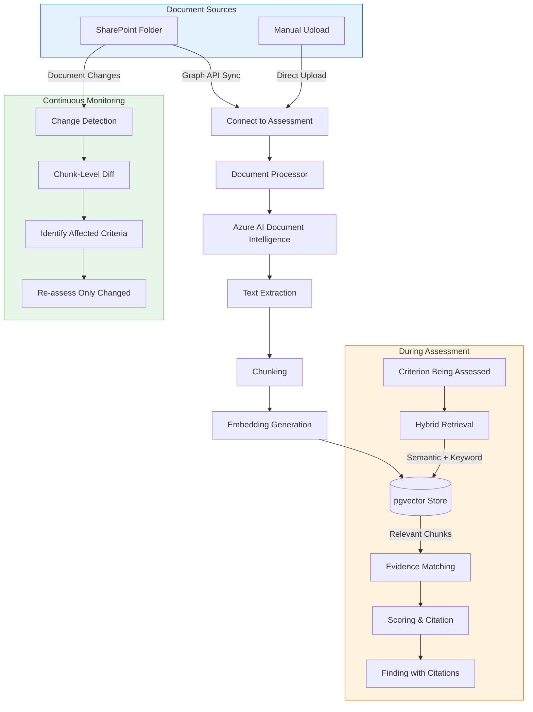

## Key Concepts

| Concept | Description |
|---------|-------------|
| **Connect, don't upload** | Documents stay where they live (SharePoint). Programme Insights binds to the source and syncs on demand. |
| **Live binding** | When source documents change, the platform detects changes and can trigger re-assessment. |
| **Chunk-level delta** | Only criteria whose evidence depended on changed content are re-scored — the rest retain their prior result. |
| **Citation anchoring** | Every finding cites the exact paragraph in the source document. Citations are highlighted in the document viewer. |

## Document States

| State | Meaning |
|-------|---------|
| **Uploaded** | File received, awaiting processing |
| **Processing** | Text extraction and embedding generation in progress |
| **Processed** | Ready for use in assessments |
| **Error** | Processing failed — file may be corrupt or unsupported format |
