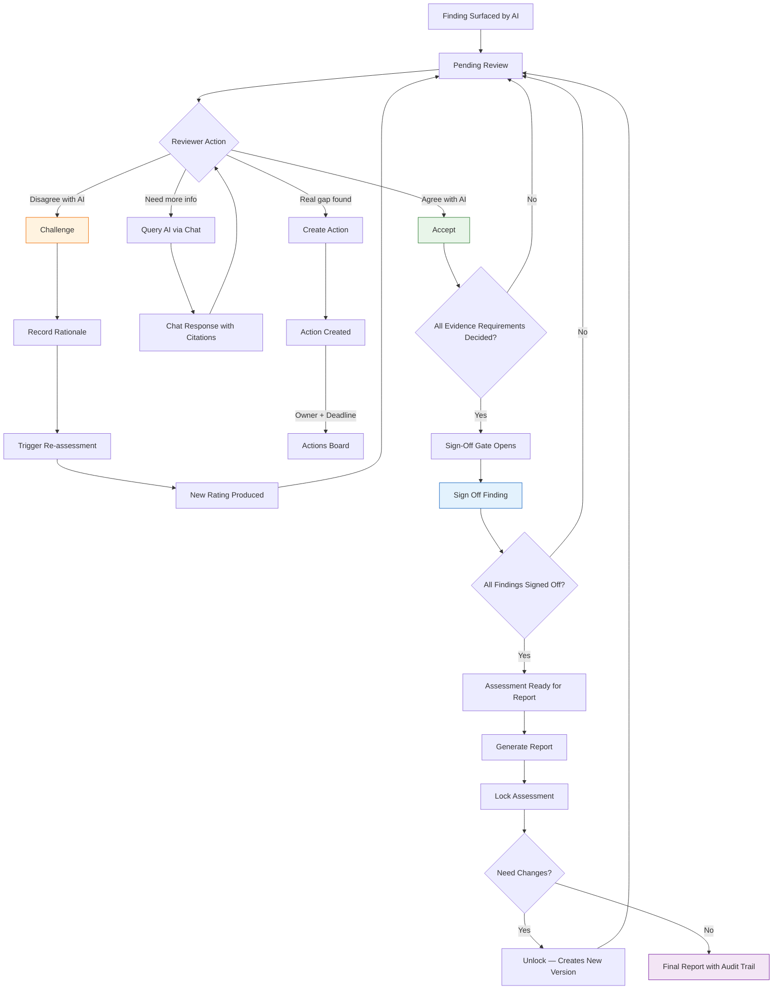

## The Four Reviewer Actions

| Action | When to use | What happens |
|--------|-------------|-------------|
| **Accept** | AI's assessment is correct | Finding marked as accepted; moves to next |
| **Challenge** | AI is wrong or incomplete | Rationale recorded; re-assessment triggered with new context |
| **Query AI** | Need more information before deciding | Finding-scoped chat opens; AI responds with citations |
| **Create Action** | A genuine gap that needs remediation | Action item created with owner and deadline |

## Sign-Off Rules

1. Every evidence requirement within a finding must have a decision (accepted or challenged)
2. The sign-off bar tracks progress live — accepted, challenged, pending
3. Only when all requirements are decided does the "Sign off finding" button activate
4. This is the human-in-the-loop audit trail that makes PI defensible in assurance

## Keyboard Shortcuts (Power Reviewers)

| Key | Action |
|-----|--------|
| `J` / `K` | Navigate to next / previous finding |
| `A` | Accept the focused requirement |
| `C` | Challenge |
| `?` | Show all shortcuts |
| `Esc` | Close the action drawer |
